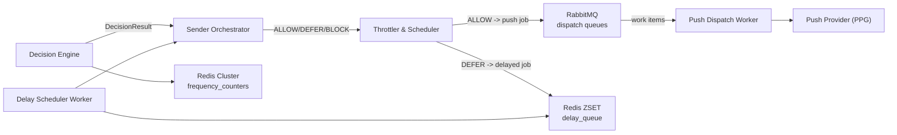
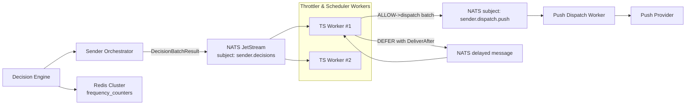
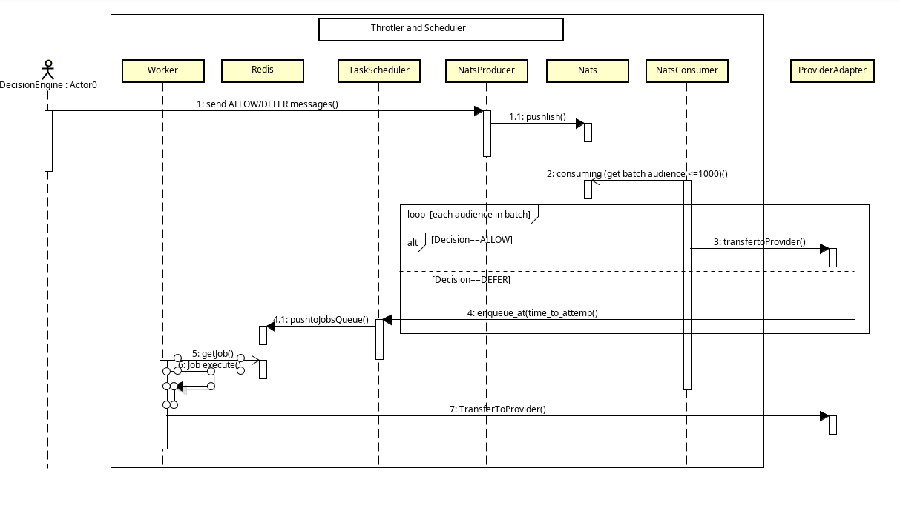

# sender-2.0-Throttler-Scheduler-Counter
Throttler-Scheduler-Counter solutions (RD)

## Option A: RabbitMQ + Redis (not official)

**Components**:

- RabbitMQ = message broker.
- Redis = counters store + delay queue (optional).

## Option B: NATS JetStream + Redis (not official)

**Components**:

- NATS + JetStream = event/stream & work queue.
- Redis = counters.

# Throttler and Scheduler Diagrams
## Sequence Diagram

**Deploy and Simulation Step**
1. Run up nats and redis servers by docker-compose
   > docker-compose up redis nats
2. Install must have python lib by pip command
   >pip3 install -r requirements.txt
3. Update ip of nats and redis in file base/config/config.py  
4. Run consumer and publisher nats by script nats_process.sh
   >chmod u+x nats_process.sh
   >source nats_process.sh
5. Run scheduler worker to perfom jobs at their execution time 
   >chmod u+x worker-wakeup.sh
   >source worker-wakeup.sh

6. Optional run rq-dashboard to see and monitor information of scheduler
   >rq-dashboard -u redis://10.0.0.115:6379       